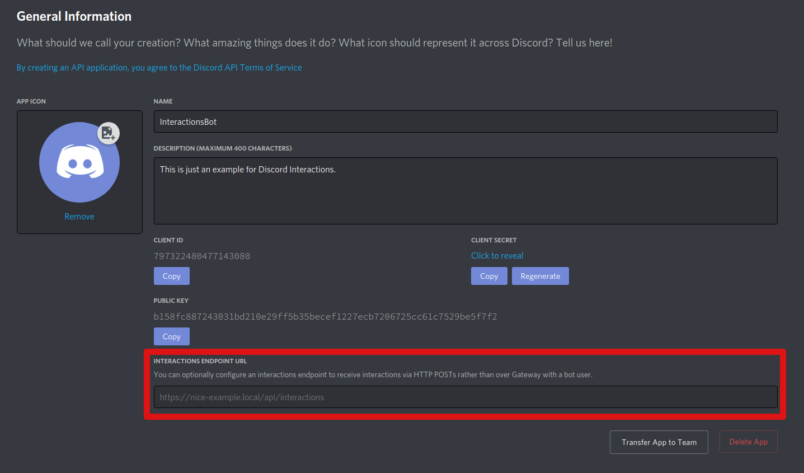

Discord Interactions
====================

This repository is an example for how to make `Discord Interactions`_
(or more specifically Slash Commands) work via **outgoing webhook** as opposed to the
websocket gateway.

This example uses Python and the `discord-interactions.py`_ library's Flask_ extension.
To make a URL available to Discord, the code is built into a Docker_ image
and then hosted in a container on `Google Cloud Run`_,
which is a serverless_ cloud platform. Cloud Run will automatically generate a
URL which can be used to call the service. This URL then needs to be put in the
"Interactions Endpoint URL" field on the application's page on the
`Discord Developer Portal`_.

File Structure
--------------

In this example, there are three files that contain our Python code.

main.py
~~~~~~~

This file contains all the commands' logic and the required setup for Flask.
It gets run as the entrypoint to our application.

commands.py
~~~~~~~~~~~

Here, we define the structure of our commands using discord-interaction.py's
Object-Command Mapper. The command classes get imported by ``main.py`` and
``register_commands.py``.

register_commands.py
~~~~~~~~~~~~~~~~~~~~

In order to separate the registration of our commands and the actual execution of
our app, we take care of the former in this file.
What happens here is that we tell Discord about our commands and their structure so
they can be recognised by Discord and we get that neat autocompletion in the Discord
client. That also means, that this file needs to be executed separately from ``main.py``
to make the commands be callable from Discord in the first place. It only needs to be
run once when you first setup the commands and then everytime you change something
about a command's structure.

**Note:** It takes up to one hour after registration for global commands to be available
for use. If you want to have commands available instantly for testing purposes or if
you only want them to be available on one Discord Server, you can use guild commands.
`Read more about global and guild commands.`__

__ https://discord.com/developers/docs/interactions/slash-commands#registering-a-command

.. _Discord Interactions: https://discord.com/developers/docs/interactions/slash-commands
.. _discord-interactions.py: https://github.com/LiBa001/discord-interactions.py
.. _Flask: https://flask.palletsprojects.com/
.. _Docker: https://www.docker.com/resources/what-container
.. _Google Cloud Run: https://cloud.google.com/run
.. _serverless: https://en.wikipedia.org/wiki/Serverless_computing
.. _Discord Developer Portal: https://discord.com/developers/applications
